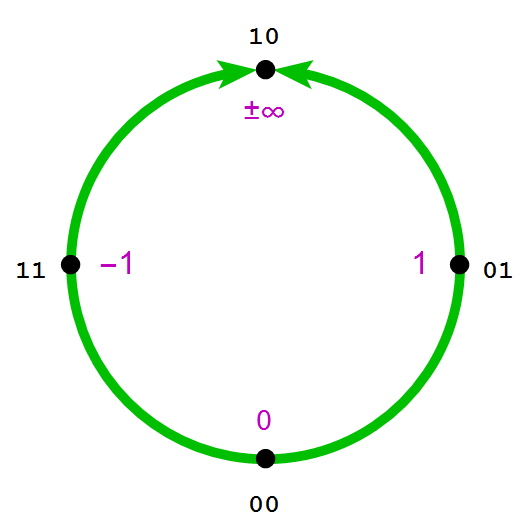
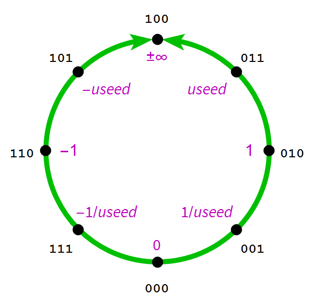
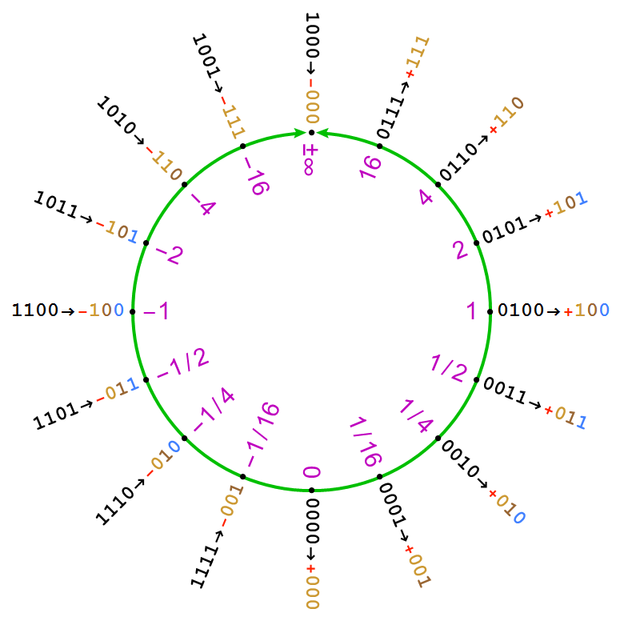
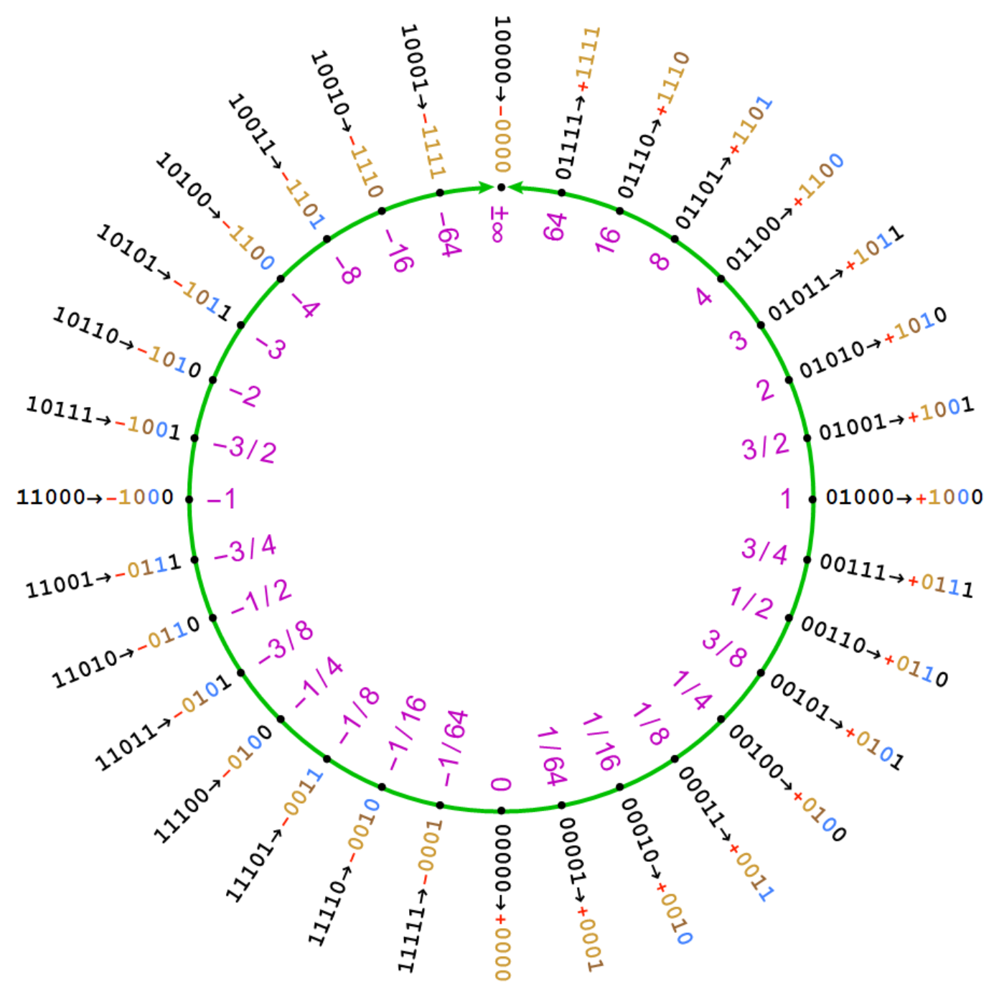
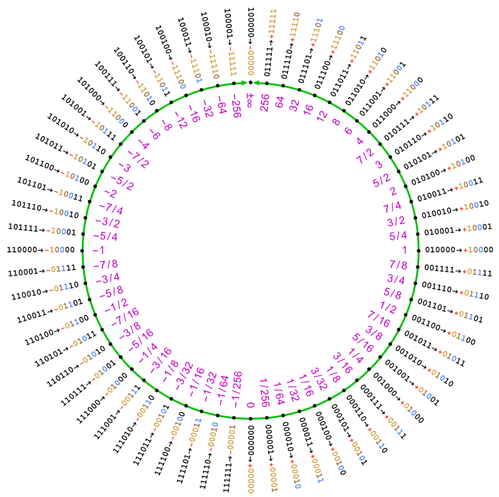
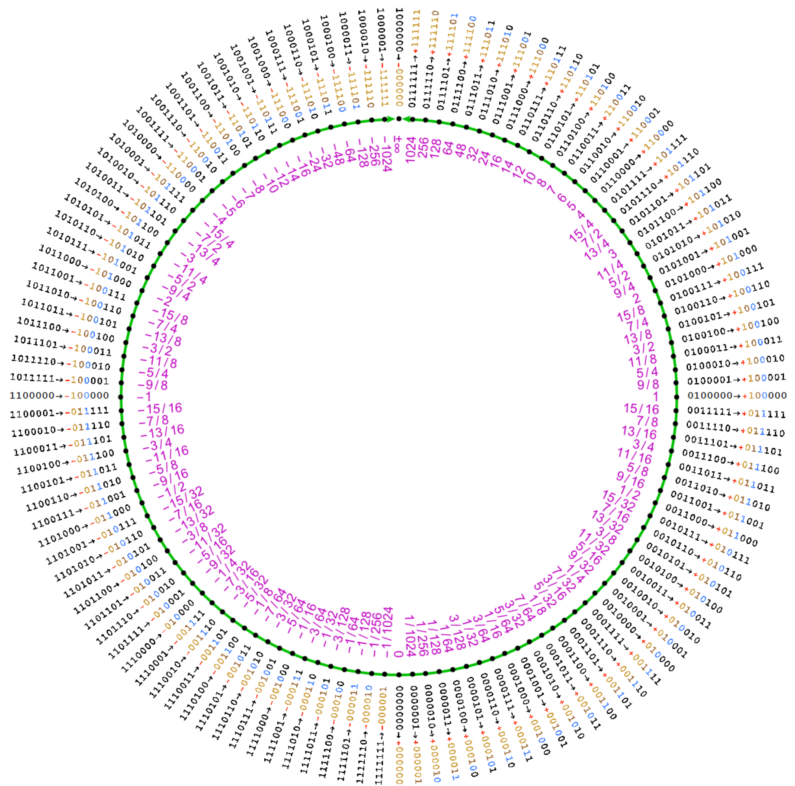

# Universal: a C++ template library for universal number arithmetic

Universal Numbers, or unums, are a collection of number systems to replace floating point with more efficient and mathematically correct arithmetic properties.

# How to build

The universal numbers software library is built with cmake. 
Install the latest cmake [cmake](https://cmake.org/download).

The library is a pure template library without any further dependencies.

Simply clone the github repo, and you are ready to build the universal library. What you are building are tools to work with floats and posits, educational programs that highlight the use of the posit library, and the posit verification suite. Make test (or better yet ctest -j 16 (or how many cores you have)) will run the posit verification suite and can be used as a regression capability. This will take several minutes but will touch all the corners of the posit functionality.

```
> git clone https://github.com/stillwater-sc/universal
> cd universal/build
> cmake ..
> make
> make test

```
The library builds a set of useful command utilities, which can be found in the directory ".../build/tools/cmd".

```
>:~/dev/universal/build$ make cmd_ieee_fp
Scanning dependencies of target cmd_ieee_fp
[ 50%] Building CXX object tools/cmd/CMakeFiles/cmd_ieee_fp.dir/ieee_fp.cpp.o
[100%] Linking CXX executable cmd_ieee_fp
[100%] Built target cmd_ieee_fp
>:~/dev/universal/build$ tools/cmd/cmd_ieee_fp 1.234567890123456789012
input value:   1.234567890123456789012
      float:                1.23456788 (+,0,00111100000011001010010)
     double:        1.2345678901234567 (+,0,0011110000001100101001000010100011000101100111111011)
long double:    1.23456789012345669043 (+,0,000000000000001111000000110010100100001010001100010110011111101)
```
The command _cmd_ieee_fp_ is very handy to quickly determine how your development environment represents (truncates) a specific value. There are also the specific commands _cmd_fc_, _cmd_dc_, and _cmd_ldc_, which focus on float, double, and long double representations respectively.

There is also a command _cmd_pc_ to help you visualize and compare the posit component fields for a given value:
```
>:~/dev/universal/build$ make cmd_pc
Scanning dependencies of target cmd_pc
[100%] Building CXX object tools/cmd/CMakeFiles/cmd_pc.dir/pc.cpp.o
[100%] Linking CXX executable cmd_pc
[100%] Built target cmd_pc
>:~/dev/universal/build$ tools/cmd/cmd_pc 1.234567890123456789012
posit< 8,0> = s0 r10 e f01000 qNE v1.25
posit< 8,1> = s0 r10 e0 f0100 qNE v1.25
posit< 8,2> = s0 r10 e00 f010 qNE v1.25
posit< 8,3> = s0 r10 e000 f01 qNE v1.25
posit<16,1> = s0 r10 e0 f001111000001 qNE v1.234619140625
posit<16,2> = s0 r10 e00 f00111100000 qNE v1.234375
posit<16,3> = s0 r10 e000 f0011110000 qNE v1.234375
posit<32,1> = s0 r10 e0 f0011110000001100101001000011 qNE v1.2345678918063641
posit<32,2> = s0 r10 e00 f001111000000110010100100001 qNE v1.2345678880810738
posit<32,3> = s0 r10 e000 f00111100000011001010010001 qNE v1.2345678955316544
posit<48,1> = s0 r10 e0 f00111100000011001010010000101000110001011010 qNE v1.2345678901234578
posit<48,2> = s0 r10 e00 f0011110000001100101001000010100011000101101 qNE v1.2345678901234578
posit<48,3> = s0 r10 e000 f001111000000110010100100001010001100010110 qNE v1.2345678901233441
posit<64,1> = s0 r10 e0 f001111000000110010100100001010001100010110011111101100000000 qNE v1.2345678901234567
posit<64,2> = s0 r10 e00 f00111100000011001010010000101000110001011001111110110000000 qNE v1.2345678901234567
posit<64,3> = s0 r10 e000 f0011110000001100101001000010100011000101100111111011000000 qNE v1.2345678901234567
posit<64,4> = s0 r10 e0000 f001111000000110010100100001010001100010110011111101100000 qNE v1.2345678901234567
```

The fields are prefixed by their first characters, for example, "posit<16,2> = s0 r10 e00 f00111100000 qNE v1.234375"
- sign     field = s0, indicating a positive number
- regime   field = r10, indicates the first positive regime, named regime 0
- exponent field = e00, indicates two bits of exponent, both 0
- fraction field = f00111100000, a full set of fraction bits

The field values are followed by a quadrant descriptor and a value representation in decimal:

- qNE            = North-East Quadrant, representing a number in the range "[1, maxpos]"
- v1.234375      = the value representation of the posit projection

The positive regime for a posit shows a very specific structure, as can be seen in the image blow:


# Motivation

Modern AI applications have demonstrated the inefficiencies of the IEEE floating point format. Both Google and Microsoft have jettisonned IEEE floating point for their AI cloud services to gain two orders of magnitude better performance. Similarly, AI applications for mobile and embedded applications are shifting away from IEEE floating point. But, AI applications are hardly the only applications that expose the limitations of floating point. Cloud scale, IoT, embedded, control, and HPC applications are also limited by the inefficiencies of the IEEE floating point format. A simple change to a new number system can improve scale and cost of these appliations by orders of magnitude.

When performance and/or power efficiency are differentiating attributes for the use case, the complexity of IEEE floats simply can't compete with number systems that are tailored to the needs of the application. 

## Advantages of posits: better, faster, cheaper, and more power efficient

The core limitations of IEEE floating point are caused by two key problems of the format: 
- inefficient representation of the reals
- irreproducibility in the context of concurrency

The complete list of issues that are holding back IEEE floating point formats:
1. **Wasted Bit Patterns** - 32-bit IEEE floating point has around sixteen million ways to represent NaN (Not-A-Number), while 64-bit floating point has nine quadrillion. A NaN is an exception value for invalid operations such as division by zero.
2. **Mathematically Incorrect** - The format specifies two zeroes - a negative and positive zero - which have different behaviors. - Loss of associative and distributive law due to rounding after each operation. This loss of associative and distributive arithmetic behavior creates irreproducible result of concurrent programs that use IEEE floating point. This is particularly problematic for embedded and control applications.
3. **Overflows to ± inf and underflows to 0** - Overflowing to ± inf increases the relative error by an infinite factor, while underflowing to 0 loses sign information.
4. **Unused dynamic range** - The dynamic range of double precision floats is a whopping 2^2047, whereas most numerical software is architected to operate around 1.0.
5. **Complicated Circuitry** - Denormalized floating point numbers have a hidden bit of 0 instead of 1. This creates
a host of special handling requirements that complicate compliant hardware implementations.
6. **No Gradual Overflow and Fixed Accuracy** - If accuracy is defined as the number of significand bits, IEEE
floating point have fixed accuracy for all numbers except denormalized numbers because the number of signficand
digits is fixed. Denormalized numbers are characterized by a decreased number of significand digits when the value approaches zero as a result of having a zero hidden bit. Denormalized numbers fill the underflow gap (i.e.
the gap between zero and the least non-zero values). The counterpart for gradual underflow is gradual overflow
which does not exist in IEEE floating points.

In contrast, the _posit_ number system is designed to be efficient, symmetric, and mathematically correct in any concurrency environment.

1. **Economical** - No bit patterns are redundant. There is one representation for infinity denoted as ± inf and zero.
All other bit patterns are valid distinct non-zero real numbers. ± inf serves as a replacement for NaN.
2. **Mathematical Elegant** - There is only one representation for zero, and the encoding is symmetric around 1.0. Associative and distributive laws are supported through deferred rounding via the quire, enabling reproducible linear algebra algorithms in any concurrency environment.
3. **Tapered Accuracy** - Tapered accuracy is when values with small exponent have more digits of accuracy and values with large exponents have less digits of accuracy. This concept was first introduced by Morris (1971) in his paper ”Tapered Floating Point: A New Floating-Point Representation”.
4. **Parameterized precision and dynamic range** -- posits are defined by a size, _nbits_, and the number of exponent bits, _es_. This enables system designers the freedom to pick the right precision and dynamic range required for the application. For example, for AI applications we may pick 5 or 6 bit posits without any exponent bits to improve performance. For embedded DSP applications, such as 5G base stations, we may select a 16 bit posit with 1 exponent bit to improve performance per Watt.
5. **Simpler Circuitry** - There are only two special cases, Not a Real and Zero. No denormalized numbers, overflow, or underflow. 

# Goals of the library

This library is a bit-level arithmetic reference implementation of the evolving unum III (posit and valid) standard.
The goal is to provide a faithful posit arithmetic layer for any C/C++/Python environment.

As a reference library, there is extensive test infrastructure to validate the arithmetic, and there is a host
of utilities to become familiar with the internal workings of posits and valids.

We want to provide a complete unum library, and we are looking for contributors to finish the Type I and II unum implementations.

# Contributing to universal

We are happy to accept pull requests via GitHub. The only requirement that we would like PR's to adhere to
is that all the test cases pass, so that we know the new code isn't breaking any functionality. 

# Verification Suite

Normally, the verification suite is run as part of the _make test_ command in the build directory. However, it is possible to run specific components of the test suite, for example, to validate algorithmic changes to more complex arithmetic functions, such as square root, exponent, logarithm, and trigonometric functions.

Here is an example:
```
>:~/dev/universal/build$ make posit_32bit_posit
Scanning dependencies of target posit_32bit_posit
[100%] Building CXX object tests/posit/CMakeFiles/posit_32bit_posit.dir/32bit_posit.cpp.o
[100%] Linking CXX executable posit_32bit_posit
[100%] Built target posit_32bit_posit
>:~/dev/universal/build$ tests/posit/posit_32bit_posit
Standard posit<32,2> configuration tests
 posit< 32,2> useed scale     4     minpos scale       -120     maxpos scale        120

Arithmetic tests 200000 randoms each
 posit<32,2> addition       PASS
 posit<32,2> subtraction    PASS
 posit<32,2> multiplication PASS
 posit<32,2> division       PASS
```

# Structure of the tree

The universal library contains a set of functionality groups to deal with different number systems. In the examples shown above, we have seen the ".../universal/posit" group and its test suite, ".../universal/tests/posit". Here is a complete list:

- *universal/posit* - contains the implementation of the posit number system
- *universal/valid* - contains the implementation of the valid number system
- *universal/unum* - contains the implementation of the unum Type I number system (TBD)
- *universal/unum2* - contains the implementation of the unum Type II number system (TBD)
- *universal/float* - contains the implementation of the IEEE floating point augmentations for reproducible computation
- *universal/bitset* - contains the implementation of an abitrary integer number system

And each of these functionality groups have an associated test suite located in ".../universal/tests/..."

# Background information

Universal numbers, unums for short, are for expressing real numbers, and ranges of real numbers. 
There are two modes of operation, selectable by the programmer, _posit_ mode, and _valid_ mode.

In _posit_ mode, a unum behaves much like a floating-point number of fixed size, 
rounding to the nearest expressible value if the result of a calculation is not expressible exactly.
A posit offers more accuracy and a larger dynamic range than floats with the same number of bits.

In _valid_ mode, a unum represents a range of real numbers and can be used to rigorously bound answers 
much like interval arithmetic does.

Posit configurations have a very specific relationship to one another. When expanding a posit, the new value falls 'between' the old values of the smaller posit. Between is the arithmetic mean of the two numbers if the expanding bit is a fraction bit, and it is the geometric mean of the two numbers if the expanding bit is an exponent or regime bit. Here is the starting progression from _posit<2,0>_ to _posit<7,1>_:

The _seed_ posit:



_posit<3,0>_:



_posit<4,1>_:



_posit<5,1>_:


_posit<6,1>_:


_posit<7,1>_:


The program ".../tests/posit/posit_tables" will generate the posit encodings for reference. These tables are a great aid in understanding posit arithmetic and rounding.
```
>:~/dev/universal/build$ tests/posit/posit_tables
Generate posit configurations
-128         100101         111011 Sign : -1 Regime :   1 Exponent :     8 Fraction :        1 Value :             -128 11
Generate Posit Lookup table for a POSIT<3,0>
   #           Binary         Decoded       k    sign   scale          regime        exponent        fraction                         value
   0:              000             000      -2       1      -2               00               ~               ~                             0
   1:              001             001      -1       1      -1               01               ~               ~                           0.5
   2:              010             010       0       1       0               10               ~               ~                             1
   3:              011             011       1       1       1               11               ~               ~                             2
   4:              100             100       2      -1       2               00               ~               ~                           nan
   5:              101             111       1      -1       1               11               ~               ~                            -2
   6:              110             110       0      -1       0               10               ~               ~                            -1
   7:              111             101      -1      -1      -1               01               ~               ~                          -0.5
Generate Posit Lookup table for a POSIT<4,0>
   #           Binary         Decoded       k    sign   scale          regime        exponent        fraction                         value
   0:             0000            0000      -3       1      -3               000               ~               -                             0
   1:             0001            0001      -2       1      -2               001               ~               -                          0.25
   2:             0010            0010      -1       1      -1               01-               ~               0                           0.5
   3:             0011            0011      -1       1      -1               01-               ~               1                          0.75
   4:             0100            0100       0       1       0               10-               ~               0                             1
   5:             0101            0101       0       1       0               10-               ~               1                           1.5
   6:             0110            0110       1       1       1               110               ~               -                             2
   7:             0111            0111       2       1       2               111               ~               -                             4
   8:             1000            1000       3      -1       3               000               ~               -                           nan
   9:             1001            1111       2      -1       2               111               ~               -                            -4
  10:             1010            1110       1      -1       1               110               ~               -                            -2
  11:             1011            1101       0      -1       0               10-               ~               1                          -1.5
  12:             1100            1100       0      -1       0               10-               ~               0                            -1
  13:             1101            1011      -1      -1      -1               01-               ~               1                         -0.75
  14:             1110            1010      -1      -1      -1               01-               ~               0                          -0.5
  15:             1111            1001      -2      -1      -2               001               ~               -                         -0.25
Generate Posit Lookup table for a POSIT<4,1>
   #           Binary         Decoded       k    sign   scale          regime        exponent        fraction                         value
   0:             0000            0000      -3       1      -6               000               -               ~                             0
   1:             0001            0001      -2       1      -4               001               -               ~                        0.0625
   2:             0010            0010      -1       1      -2               01-               0               ~                          0.25
   3:             0011            0011      -1       1      -1               01-               1               ~                           0.5
   4:             0100            0100       0       1       0               10-               0               ~                             1
   5:             0101            0101       0       1       1               10-               1               ~                             2
   6:             0110            0110       1       1       2               110               -               ~                             4
   7:             0111            0111       2       1       4               111               -               ~                            16
   8:             1000            1000       3      -1       6               000               -               ~                           nan
   9:             1001            1111       2      -1       4               111               -               ~                           -16
  10:             1010            1110       1      -1       2               110               -               ~                            -4
  11:             1011            1101       0      -1       1               10-               1               ~                            -2
  12:             1100            1100       0      -1       0               10-               0               ~                            -1
  13:             1101            1011      -1      -1      -1               01-               1               ~                          -0.5
  14:             1110            1010      -1      -1      -2               01-               0               ~                         -0.25
  15:             1111            1001      -2      -1      -4               001               -               ~                       -0.0625
Generate Posit Lookup table for a POSIT<5,0>
   #           Binary         Decoded       k    sign   scale          regime        exponent        fraction                         value
   0:            00000           00000      -4       1      -4               0000               ~               --                             0
   1:            00001           00001      -3       1      -3               0001               ~               --                         0.125
   2:            00010           00010      -2       1      -2               001-               ~               0-                          0.25
   3:            00011           00011      -2       1      -2               001-               ~               1-                         0.375
   4:            00100           00100      -1       1      -1               01--               ~               00                           0.5
   5:            00101           00101      -1       1      -1               01--               ~               01                         0.625
   6:            00110           00110      -1       1      -1               01--               ~               10                          0.75
   7:            00111           00111      -1       1      -1               01--               ~               11                         0.875
   8:            01000           01000       0       1       0               10--               ~               00                             1
   9:            01001           01001       0       1       0               10--               ~               01                          1.25
  10:            01010           01010       0       1       0               10--               ~               10                           1.5
  11:            01011           01011       0       1       0               10--               ~               11                          1.75
  12:            01100           01100       1       1       1               110-               ~               0-                             2
  13:            01101           01101       1       1       1               110-               ~               1-                             3
  14:            01110           01110       2       1       2               1110               ~               --                             4
  15:            01111           01111       3       1       3               1111               ~               --                             8
  16:            10000           10000       4      -1       4               0000               ~               --                           nan
  17:            10001           11111       3      -1       3               1111               ~               --                            -8
  18:            10010           11110       2      -1       2               1110               ~               --                            -4
  19:            10011           11101       1      -1       1               110-               ~               1-                            -3
  20:            10100           11100       1      -1       1               110-               ~               0-                            -2
  21:            10101           11011       0      -1       0               10--               ~               11                         -1.75
  22:            10110           11010       0      -1       0               10--               ~               10                          -1.5
  23:            10111           11001       0      -1       0               10--               ~               01                         -1.25
  24:            11000           11000       0      -1       0               10--               ~               00                            -1
  25:            11001           10111      -1      -1      -1               01--               ~               11                        -0.875
  26:            11010           10110      -1      -1      -1               01--               ~               10                         -0.75
  27:            11011           10101      -1      -1      -1               01--               ~               01                        -0.625
  28:            11100           10100      -1      -1      -1               01--               ~               00                          -0.5
  29:            11101           10011      -2      -1      -2               001-               ~               1-                        -0.375
  30:            11110           10010      -2      -1      -2               001-               ~               0-                         -0.25
  31:            11111           10001      -3      -1      -3               0001               ~               --                        -0.125
Generate Posit Lookup table for a POSIT<5,1>
   #           Binary         Decoded       k    sign   scale          regime        exponent        fraction                         value
   0:            00000           00000      -4       1      -8               0000               -               -                             0
   1:            00001           00001      -3       1      -6               0001               -               -                      0.015625
   2:            00010           00010      -2       1      -4               001-               0               -                        0.0625
   3:            00011           00011      -2       1      -3               001-               1               -                         0.125
   4:            00100           00100      -1       1      -2               01--               0               0                          0.25
   5:            00101           00101      -1       1      -2               01--               0               1                         0.375
   6:            00110           00110      -1       1      -1               01--               1               0                           0.5
   7:            00111           00111      -1       1      -1               01--               1               1                          0.75
   8:            01000           01000       0       1       0               10--               0               0                             1
   9:            01001           01001       0       1       0               10--               0               1                           1.5
  10:            01010           01010       0       1       1               10--               1               0                             2
  11:            01011           01011       0       1       1               10--               1               1                             3
  12:            01100           01100       1       1       2               110-               0               -                             4
  13:            01101           01101       1       1       3               110-               1               -                             8
  14:            01110           01110       2       1       4               1110               -               -                            16
  15:            01111           01111       3       1       6               1111               -               -                            64
  16:            10000           10000       4      -1       8               0000               -               -                           nan
  17:            10001           11111       3      -1       6               1111               -               -                           -64
  18:            10010           11110       2      -1       4               1110               -               -                           -16
  19:            10011           11101       1      -1       3               110-               1               -                            -8
  20:            10100           11100       1      -1       2               110-               0               -                            -4
  21:            10101           11011       0      -1       1               10--               1               1                            -3
  22:            10110           11010       0      -1       1               10--               1               0                            -2
  23:            10111           11001       0      -1       0               10--               0               1                          -1.5
  24:            11000           11000       0      -1       0               10--               0               0                            -1
  25:            11001           10111      -1      -1      -1               01--               1               1                         -0.75
  26:            11010           10110      -1      -1      -1               01--               1               0                          -0.5
  27:            11011           10101      -1      -1      -2               01--               0               1                        -0.375
  28:            11100           10100      -1      -1      -2               01--               0               0                         -0.25
  29:            11101           10011      -2      -1      -3               001-               1               -                        -0.125
  30:            11110           10010      -2      -1      -4               001-               0               -                       -0.0625
  31:            11111           10001      -3      -1      -6               0001               -               -                     -0.015625
Generate Posit Lookup table for a POSIT<5,2>
   #           Binary         Decoded       k    sign   scale          regime        exponent        fraction                         value
   0:            00000           00000      -4       1     -16               0000               --               ~                             0
   1:            00001           00001      -3       1     -12               0001               --               ~                0.000244140625
   2:            00010           00010      -2       1      -8               001-               0-               ~                    0.00390625
   3:            00011           00011      -2       1      -6               001-               1-               ~                      0.015625
   4:            00100           00100      -1       1      -4               01--               00               ~                        0.0625
   5:            00101           00101      -1       1      -3               01--               01               ~                         0.125
   6:            00110           00110      -1       1      -2               01--               10               ~                          0.25
   7:            00111           00111      -1       1      -1               01--               11               ~                           0.5
   8:            01000           01000       0       1       0               10--               00               ~                             1
   9:            01001           01001       0       1       1               10--               01               ~                             2
  10:            01010           01010       0       1       2               10--               10               ~                             4
  11:            01011           01011       0       1       3               10--               11               ~                             8
  12:            01100           01100       1       1       4               110-               0-               ~                            16
  13:            01101           01101       1       1       6               110-               1-               ~                            64
  14:            01110           01110       2       1       8               1110               --               ~                           256
  15:            01111           01111       3       1      12               1111               --               ~                          4096
  16:            10000           10000       4      -1      16               0000               --               ~                           nan
  17:            10001           11111       3      -1      12               1111               --               ~                         -4096
  18:            10010           11110       2      -1       8               1110               --               ~                          -256
  19:            10011           11101       1      -1       6               110-               1-               ~                           -64
  20:            10100           11100       1      -1       4               110-               0-               ~                           -16
  21:            10101           11011       0      -1       3               10--               11               ~                            -8
  22:            10110           11010       0      -1       2               10--               10               ~                            -4
  23:            10111           11001       0      -1       1               10--               01               ~                            -2
  24:            11000           11000       0      -1       0               10--               00               ~                            -1
  25:            11001           10111      -1      -1      -1               01--               11               ~                          -0.5
  26:            11010           10110      -1      -1      -2               01--               10               ~                         -0.25
  27:            11011           10101      -1      -1      -3               01--               01               ~                        -0.125
  28:            11100           10100      -1      -1      -4               01--               00               ~                       -0.0625
  29:            11101           10011      -2      -1      -6               001-               1-               ~                     -0.015625
  30:            11110           10010      -2      -1      -8               001-               0-               ~                   -0.00390625
  31:            11111           10001      -3      -1     -12               0001               --               ~               -0.000244140625
```

The unum format is a public domain specification, and there are a collection of web resources that
manage information and discussions around the use of unums.

[Posit Hub](https://posithub.org)

[Unum-computing Google Group](https://groups.google.com/forum/#!forum/unum-computing)


